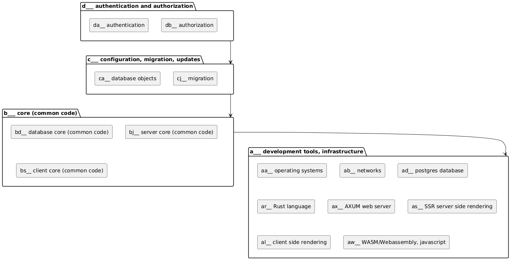

# liporuwcha

***Framework Stack Linux-Postgres-Rust-WASM-CSS3-HTML5-Axum***

 
 
 
 
 

   
 liporuwcha is a "GitHub organization" that groups [multiple repositories](https://github.com/orgs/liporuwcha/repositories?q=sort%3Aname-asc) together

## Motivation

I would like to code some useful small programs. It is my hobby. These programs will live on the web. Why code anything else today?

Programming things from zero is not viable. Maybe for educational purposes, but it is not productive at all. I need a basic framework to build programs on top of it. Frameworks are both a blessing and a curse. They are productive for the use-case they are created for, but limit the freedom to code anything different.

This is not meant to be a commercial product or whatever. It is a reasonably usable and simple framework for hobby programs.

Without exceptions, sooner or later every program needs a database. I think Postgres is a great open source database. This is the main point of my programs: get some data from the user, transform it somehow and return it to the user in a different form. 90% of that is going to work inside the database. It is not great for scalability, but that is not a problem I will ever encounter.

The client cannot be connected directly to the database. That is a no-no. We need a web server with some middleware. I choose the Rust language and one of its library crates Axum for the web server.

The only client I need is a browser. All modern browsers work with HTML5, CSS3 and WebAssembly/WASM. There exists PWA/progressive web applications, electron or Tauri to make the web app feel like a native one. I think it is a good trick to make the client truly cross-platform.

This three-tier architecture has great potential. I don't see the point to make it any less flexible than that. There will be some complexity because of the three-tiers, but we will solve that somehow. The framework will have the tools to make our lives easier.

## Naming

Naming things is the major difficulty of programming. There is seldom a good name around. Usually when you choose one, you have to stick with it forever.

I choose the strange unique name **"liporuwcha"** for this project. It does not mean anything. It is barely pronounceable. It is an abbreviation of the Stack Linux-Postgres-Rust-WASM-CSS3-HTML5-Axum. This will be the name of my "framework". On top of this framework it will be relatively easy to add functionality or different apps.

The nature of three-tier architecture makes it difficult to use just one specialized tool. So tooling is limited and I want to use namespaces to make code searchable through every tier. Search-all-and-replace will be most of my "intelligent coding tool".

I hope that the character "_" underscore is available everywhere. The names will use the snake case style like `abc_what_a_nice_name`. I choose that to avoid problems with case sensitive and not case sensitive languages and technologies.

## Namespaces

This project is way too complex that I would like it to be. But I must bite this sour apple. I cannot work on anything simple until I have this moderately complex framework. Things will be getting easier after finishing the framework.

I will try to split the project into many modules. Ideally the modules are layered in levels. The higher level module can have dependency on lower modules, but it is forbidden to depend in the opposite direction. This rule will sometimes complicate things, but the resulting code will be reasonably maintainable.

I hope I will not mess this up, because later it will be impossible to change the names and namespaces.

I think a `three latter namespace` is good for my use-case.
The first letter defines a big project, that is not dependent of what comes after it.

- [a___ development tools, infrastructure](https://github.com/liporuwcha/a___development_tools_infrastructure)
- [b___ common code for the framework](https://github.com/liporuwcha/b___common_code_for_the_framework)
- [c___ configuration, migration, updates](https://github.com/liporuwcha/c___configuration_migration_updates)
- [d___ authentication and authorization](https://github.com/liporuwcha/d___authentication_and_authorization)

letters in between are for future use

- z___ - webpage hit counter
    the first project on top of the framework

## PlantUML diagram



<details>
  <summary>plantuml code</summary>

```PlantUML
@startuml
top to bottom direction
skinparam componentstyle rectangle

folder "d___ authentication and authorization" as d {
[da__ authentication]
[db__ authorization]
}

folder "c___ configuration, migration, updates" as c {
  [ca__ database objects]
  [cj__ migration]
  
}

folder "b___ core (common code)" as b {
  [bd__ database core (common code)]
  [bj__ server core (common code)]
  [bs__ client core (common code)]
}

folder "a___ development tools, infrastructure" as a {
  [aa__ operating systems]
  [ab__ networks]
  [ad__ postgres database]
  [ar__ Rust language]
  [ax__ AXUM web server]
  [as__ SSR server side rendering]
  [al__ client side rendering]
  [aw__ WASM/Webassembly, javascript]
}

d -d-> c
c -d-> b
b -d-> a

@enduml
```

</details>

## Open-source and free as a beer

My open-source projects are free as a beer (MIT license).  
I just love programming.  
But I need also to drink. If you find my projects and tutorials helpful, please buy me a beer by donating to my [PayPal](https://paypal.me/LucianoBestia).  
You know the price of a beer in your local bar ;-)  
So I can drink a free beer for your health :-)  
[Na zdravje!](https://translate.google.com/?hl=en&sl=sl&tl=en&text=Na%20zdravje&op=translate) [Alla salute!](https://dictionary.cambridge.org/dictionary/italian-english/alla-salute) [Prost!](https://dictionary.cambridge.org/dictionary/german-english/prost) [Nazdravlje!](https://matadornetwork.com/nights/how-to-say-cheers-in-50-languages/) 🍻

[//bestia.dev](https://bestia.dev)  
[//github.com/bestia-dev](https://github.com/bestia-dev)  
[//bestiadev.substack.com](https://bestiadev.substack.com)  
[//youtube.com/@bestia-dev-tutorials](https://youtube.com/@bestia-dev-tutorials)  
